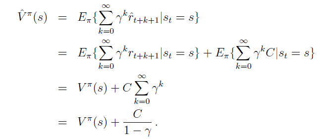

<b>Exercise 3.1: </b> Devise three example tasks of your own that fit into the reinforcement learning framework, identifying for each its states, actions, and rewards. Make the three examples as different from each other as possible. The framework is abstract and  flexible and can be applied in many different ways. Stretch its limits in some way in at least one of your examples.

<b>Solution:</b> The first example would be of a robot trying to walk from one end to the other end of a room without falling. A state here would be the position of the robot and the view of the room the robot sees then. Actions would include making steps in any direction the robot sees as useful to achieve the goal of reaching the other end. Rewards could be -1 for each step it takes and -10 or a large negative for its collapse. 

​    For the second example, consider an agent playing a game of chess. Each game position could be considered a state. Actions would be the valid moves the agent could play in the current state. Rewards would be awarded only after the game finishes i.e. a positive reward for a win and a negative reward for a loss. The rewards for the intermediate state transitions could be assigned to zero.

​    Lastly, a stock investment task could fit into the reinforcement learning framework, wherein the state would be the current stocks held and the total balance left with the agent. It could also include a list of all the stocks along with their prices that are available in the market. Actions would comprise of buy and sell transactions. Rewards would be negative for each unit of money spent and positive for each unit of money earned. 

<b><i>Exercise 3.2</i></b> Is the reinforcement learning framework adequate to usefully represent all goal-directed learning tasks? Can you think of any clear exceptions?

<b>Solution:</b> Reinforcement learning requires its rewards to be scalar values. When the rewards take form of a vector i.e. multiple rewards, the agent would find it difficult to maximize the rewards - not knowing which values to focus upon. However, if the vector values could be condensed into a single value, it would be possible to fit it into the framework.

<b><i>Exercise 3.3</i></b> Consider the problem of driving. You could define the actions in terms of the accelerator, steering wheel, and brake, that is, where your body meets the machine. Or you could dene them farther out - say, where the rubber meets the road, considering your actions to be tire torques. Or you could dene them farther in - say, where your brain meets your body, the actions being muscle twitches to control your limbs. Or you could go to a really high level and say that your actions are your choices of where to drive. What is the right level, the right place to draw the line between agent and environment? On what basis is one location of the line to be preferred over another? Is there any fundamental reason for preferring one location over another, or is it a free choice?

<b>Solution:</b> There is no single right choice here. The right place to draw the line would certainly defend on the task at hand. If the task is about modelling the interaction between a car and the driving environment, it would be a good choice to define actions in terms of steering wheel, brakes, etc. However, if the task involves interaction between a driver and the driving environment, it would make more sense to draw the line at - say, higher levels involving actions like muscle twitches. 

<b>Exercise 3.4: </b> Suppose you treated pole-balancing as an episodic task but also used discounting, with all rewards zero except for - 1 upon failure. What then would the return be at each time? How does this return differ from that in the discounted, continuing formulation of this task?

<b>Solution:</b> If pole-balancing is treated as an episodic task, the return would be 0 for a successful episode and between 0 and -1 for an unsuccessful episode. We use discount rate to restrict the return from becoming infinitely large, i.e. in other words, using a discount allows for a sum over a  window after which the reward terms get very close to zero and can be ignored. Since an episodic task has a finite number of time steps unlike continuing tasks, the return would be a sum of limited number of discounted rewards - possibly fewer than the window size. Whereas, for a continuing task, the number of rewards used to estimate the return are the same, given by the discount rate value.

<b>Exercise 3.5: </b> Imagine that you are designing a robot to run a maze. You decide to give it a reward of +1 for escaping from the maze and a reward of zero at all other times. The task seems to break down naturally into episode - the successive runs through the maze - so you decide to treat it as an episodic task, where the goal is to maximize expected total reward (3.1). After running the learning agent for a while, you find that it is showing no improvement in escaping from the maze. What is going wrong? Have you effectively communicated to the agent what you want it to achieve?

<b>Solution:</b> By "improvement" it is assumed that the robot is expected to solve the maze at a faster rate. The problem here is that we have not specified the time limit. Since there is no penalty for exploration, the robot could keep exploring all the time until it reaches the terminal state. However, if we assign a reward of -1 for each step taken by the robot, we could get it to escape the maze quickly because we are now penalizing the robot for the delays.

 <b>Exercise 3.6: Broken Vision System</b> Imagine that you are a vision system. When you are first turned on for the day, an image  floods into your camera. You can see lots of things, but not all things. You can't see objects that are occluded, and of course you can't see objects that are behind you. After seeing that first scene, do you have access to the Markov state of the environment? Suppose your camera was broken that day and you received no images at all, all day. Would you have access to the Markov state then?

<b>Solution:</b> Markov state is an information state that captures the relevant information from the past which could be useful for predicting the future. Since we do not have an entire view of the things, we do not have all the information we might need to predict the future. Therefore, we do not have access to the environment's Markov state. Also, if the camera was broken, we would have no latest pictures (current environment state) of the environment and thus no access to the Markov state.

<b>Exercise 3.7</b> There is no exercise 3.7.

<b>Exercise 3.8:</b> What is the Bellman equation for action values, that is, for q&pi;? It must give the action value q&pi;(s; a) in terms of the action values, q&pi;(s'; a'), of possible successors to the state{action pair (s; a). As a hint, the backup diagram corresponding to this equation is given in Figure 3.4b. Show the sequence of equations analogous to (3.12), but for action values.

<b>Solution:</b>

<b>Exercise 3.9:</b> The Bellman equation (3.12) must hold for each state for the value function v&pi; shown in Figure 3.5b. As an example, show numerically that this equation holds for the centre state, valued at +0.7, with respect to its four neighbouring states, valued at +2.3, +0.4, -0.4, and +0.7. (These numbers are accurate only to one decimal place.)

<b>Solution:</b> 

Consider L, R, B, T to be left, right, bottom and top respectively.

<b>Exercise 3.10</b> In the gridworld example, rewards are positive for goals, negative for running into the edge of the world, and zero the rest of the time. Are the signs of these rewards important, or only the intervals between them? Prove, using (3.2), that adding a constant c to all the rewards adds a constant, vc, to the values of all states, and thus does not affect the relative values of any states under any policies. What is vc in terms of c and &gamma;?

<b>Solution:</b> The signs of the rewards are important as they convey which ones are positive and which are negative, letting agent learn to avoid negative awards to maximise the return. 

<b>Exercise 3.11</b> Now consider adding a constant c to all the rewards in an episodic task, such as maze running. Would this have any effect, or would it leave the task unchanged as in the continuing task above? Why or why not? Give an example.

<b>Solution:</b> The addition of constant c would have an effect on the state values if the episodes are of differing time steps. However, if all the episodes we consider are of the same length (i.e. same number of time steps), it would leave the task unchanged just as it was with the continuing tasks.

<b>Exercise 3.12</b> The value of a state depends on the the values of the actions possible in that state and on how likely each action is to be taken under the current policy. We can think of this in terms of a small backup diagram rooted at the state and considering each possible action:

Give the equation corresponding to this intuition and diagram for the value at the root node, v&pi;(s), in terms of the value at the expected leaf node, q&pi;(s; a), given St = s. This expectation depends on the policy, &pi;. Then give a second equation in which the expected value is written out explicitly in terms of &pi;(a|s) such that no expected value notation appears in the equation.

<b>Solution:</b> 

<b>Exercise 3.13</b> The value of an action, q&pi;(s; a), depends on the expected next reward and the expected sum of the remaining rewards. Again we can think of this in terms of a small backup diagram, this one rooted at an action (state{action pair) and branching to the possible next states:

Give the equation corresponding to this intuition and diagram for the action value, q&pi;(s; a), in terms of the expected next reward, Rt+1, and the expected next state value, v&pi;(St+1), given that St =s and At =a. Then give a second equation, writing out the expected value explicitly in terms of p(s', r|s, a) defined by (3.6), such that no expected value notation appears in the equation.

<b>Solution:</b>

<b>Exercise 3.14</b> Draw or describe the optimal state-value function for the golf example. 

<b>Solution:</b> Given a penalty of -1 for each stroke we take to get the ball into the hole, the optimal state value would give the expected number of swings to the get the ball into the hole using any type of club. The optimal state-value function for the golf example would therefore include driving the ball until it is on the green patch - which results in a reward of -2. Once, the ball is on the green patch we could use putter and achieve the goal with a reward of -1.

<b>Exercise 3.15</b> Draw or describe the contours of the optimal action-value function for putting, q*(s; putter), for the golf example.

<b>Solution:</b> The given optimal value function would mean we are putting the ball from state s and then following the optimal policy.   If the starting state is somewhere on the green patch, it would be an optimal action. Whereas, if the starting state is beyond the green patch it wouldn't be optimal to put first, resulting in more than optimal number of steps to achieve the goal.

<b>Exercise 3.16</b> Give the Bellman equation for q* for the recycling robot.

<b>Solution:</b> 

<b>Exercise 3.17</b> Figure 3.8 gives the optimal value of the best state of the gridworld as 24.4, to one decimal place. Use your knowledge of the optimal policy and (3.2) to express this value symbolically, and then to compute it to three decimal places.

<b>Solution:</b> 

Assuming &gamma; = 0.9, the above sum would be equal to 24.419.

<b>Exercise 3.18 - Exercise 3.21:</b>

=======