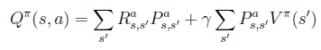
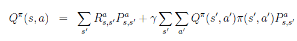
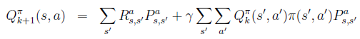
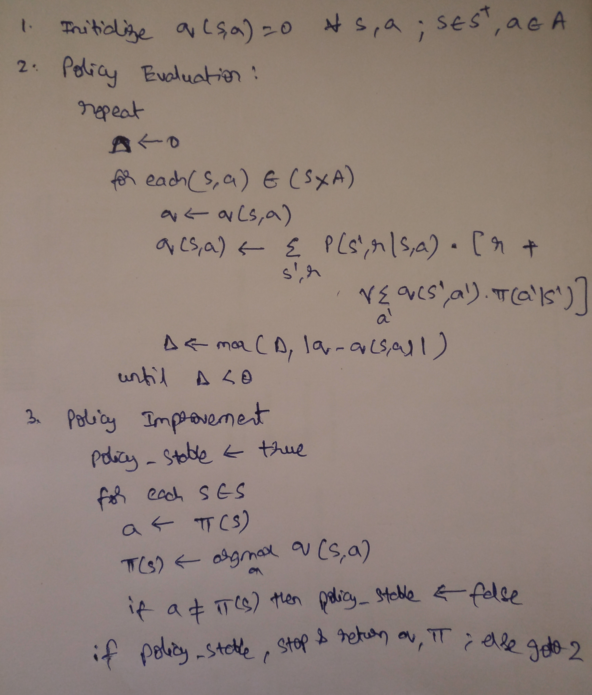

<b>Exercise 4.1: </b> In Example 4.1, if &pi; is the equiprobable random policy, what is q&pi;(11; down)? What is q&pi;(7,down)?

<b>Solution:</b> 

Taking &gamma; = 0.9,

q&pi;(11; down) = 0 · 1 + (0.9 · 1 · 0) = 0 

q&pi;(7,down) = -1 ·  1 + (0.9 ·  1 ·  -14) = -13.6

<b>Exercise 4.2:</b> In Example 4.1, suppose a new state 15 is added to the gridworld just below state 13, and its actions, left, up, right, and down, take the agent to states 12, 13, 14, and 15, respectively. Assume that the transitions from the original states are unchanged. What, then, is v&pi;(15) for the equiprobable random policy? Now suppose the dynamics of state 13 are also changed, such that action down from state 13 takes the agent to the new state 15. What is v&pi;(15) for the equiprobable random policy in this case?

<b>Solution:</b> 

Assuming that the original states are unchanged,

Taking &gamma; = 0.9,

v(15) = 0.25(Rleft + &gamma; &middot; v(12)) + 0.25(Rright + &gamma; &middot; v(14)) + 0.25(Rup + &gamma; &middot; v(13)) + 0.25(Rdown + &gamma; &middot; v(15))

v(15) = 0.25(-1 + &gamma; &middot; (-22)) + 0.25(-1 + &gamma; &middot; (-14)) + 0.25(-1 + &gamma; &middot; (-20)) + 0.25(-1 + &gamma; &middot; v(15))

v(15) = −1 − 14γ + (γ/4) &middot; v(15)

solving for v(15), 

v(15) = -17.548

Now supposing that the dynamics of state 13 are also changed, the values of all the environment states would be affected and therefore need to be re-computed. 

<b>Exercise 4.3:</b> What are the equations analogous to (4.3), (4.4), and (4.5) for the action-value function q&pi; and its successive approximation by a sequence of functions q0; q1; q2; ... ?

<b>Solution:</b> From the bellman equation derived in exercise 3.8, 

Using this for the iteration equation, we have,

<b>Exercise 4.4:</b>  In some undiscounted episodic tasks there may be policies for which eventual termination is not guaranteed. For example, in the grid problem above it is possible to go back and forth between two states forever. In a task that is otherwise perfectly sensible, v&pi;(s) may be negative infinity for some policies and states, in which case the algorithm for iterative policy evaluation given in Figure 4.1 will not terminate. As a purely practical matter, how might we amend this algorithm to as- sure termination even in this case? Assume that eventual termination is guaranteed under the optimal policy.

<b>Solution:</b> To avoid such scenarios, we could set a threshold/lower bound on the value a state could take. When a state's value goes below the threshold we could skip updating the state and continue with the other states in the state-space. 

Another approach we could take is by combining an exploratory step with the policy - as in, letting the agent take an exploratory step once in every 10 steps (to say) it takes under the given policy. This could let the agent break the never-ending loop resulting from a policy. 

Lastly, we might also check for the stability of a policy when there is more than one best action available at a state. We might consider using all the combinations of the best possible actions at different states to check for the policy stability. 

<b>Exercise 4.6:</b> How would policy iteration be dened for action values? Give a complete algorithm for computing q*, analogous to that in Figure4.3 for computing v *. Please pay special attention to this exercise, because the ideas involved will be used throughout the rest of the book.

<b>Solution:</b> 

<b>Exercise 4.7:</b> Suppose you are restricted to considering only policies that are &epsilon;-soft, meaning that the probability of selecting each action in each state, s, is at least &epsilon; /|A(s)|. Describe qualitatively the changes that would be required in each of the steps 3, 2, and 1, in that order, of the policy iteration algorithm for v*.

<b>Solution:</b> 

Step 3: We cannot use argmax to set the &pi; (s|a) to whatever maximum. We would have to make sure each state-action pair is assigned at least  &epsilon; /|A(s)| of probability under the given policy &pi; .

Step 2: No changes.

Step 1: The policy &pi; needs to be initialized keeping the lower bound probability  &epsilon; /|A(s)| in mind.

<b>Exercise 4.8:</b> Why does the optimal policy for the gambler's problem have such a curious form? In particular, for capital of 50 it bets it all on one flip, but for capital of 51 it does not. Why is this a good policy?

<b>Solution:</b> The agent here is trying to solve the problem in minimal number of steps because the probability of winning is 0.4 - which is lesser than that of losing. However, to balance the risk of losing all the capital in a single bet, it lowers it stakes for the states other than the checkpoint (do or die) states - which are 25, 50 and 75.  

<b>Exercise 4.10:</b> What is the analog of the value iteration backup (4.10) for action values, qk+1(s; a)?

<b>Solution:</b> 

qk+1 (s,a) = &Sigma;  s', r  p(s', r| s, a) [ r + &gamma; maxa' qk (s', a')  ]