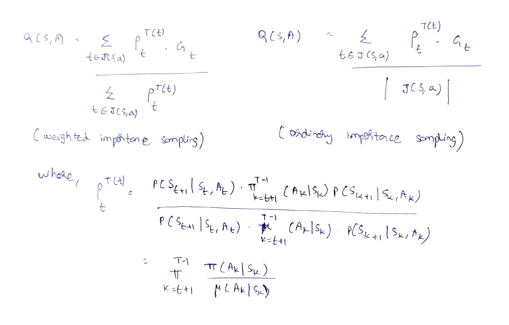
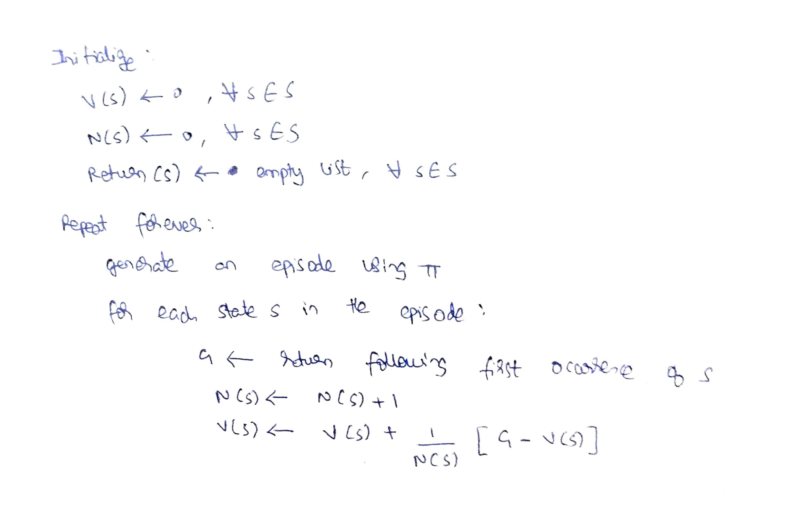
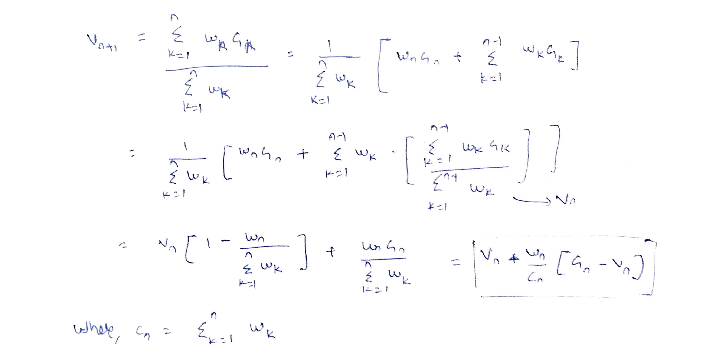

<b>Exercise 5.1: </b> Consider the diagrams on the right in Figure 5.2. Why does the estimated value function jump up for the last two rows in the rear? Why does it drop off for the whole last row on the left? Why are the frontmost values higher in the upper diagrams than in the lower?

<b>Solution:</b> The value function for the last two rows takes high value because the sum of the cards held by the player is >20 and hence the chance of winning is really high. 

The value drops off to the left because the dealer has an ace card, and hence the dealer has an advantage and more chances of winning than in the cases where he doesn't have an ace.

The frontmost values are higher in the upper diagram because of the presence of a usable ace with the player. A usable ace can be used as 11 or 1 and would thereby allow the player to not go bust as easily, thereby giving him an advantage.

<b>Exercise 5.2: </b> What is the backup diagram for Monte Carlo estimation of q&pi;?

<b>Solution:</b> Action(filled circle) -> State(empty circle) -> Action(filled circle) -> State(empty circle) -> ..... -> Terminal State

<b>Exercise 5.3: </b> What is the Monte Carlo estimate analogous to (5.5) for action values, given returns generated using &mu;?

<b>Solution:</b> 

<b>Exercise 5.4:</b> What is the equation analogous to (5.5) for action values Q(s; a) instead of state values V (s)?

<b>Solution:</b>  Same as above

<b>Exercise 5.5:</b> In learning curves such as those shown in Figure 5.7 error generally decreases with training, as indeed happened for the ordinary importance-sampling method. But for the weighted importance-sampling method error first increased and then decreased. Why do you think this happened?

<b>Solution:</b> Weighted importance sampling is biased. With lesser number of episodes the bias is observable for weighted importance sampling and hence we see the error increase. However, the bias converges to zero as the number of episodes increase.

<b>Exercise 5.6:</b> The results with Example 5.5 and shown in Figure 5.8 used a first-visit MC method. Suppose that instead an every-visit MC method was used on the same problem. Would the variance of the estimator still be infinite? Why or why not?

<b>Solution:</b> The variance of importance sampling is infinite if the variance of the scaled returns is infinite. As it is shown in the example 5.5, the variance of the scaled returns is infinite, and hence the estimator variance would still be infinite. The every-visit MC method would only increase the denominator count but that wouldn't matter since the scaled returns have infinite variance. 

<b>Exercise 5.7:</b> Modify the algorithm for first-visit MC policy evaluation (Figure 5.1) to use the incremental implementation for sample averages described in Section 2.4.

<b>Solution:</b> 

<b>Exercise 5.8:</b> Derive the weighted-average update rule (5.7) from (5.6). Follow the pattern of the derivation of the unweighted rule (2.3).

<b>Solution:</b> 