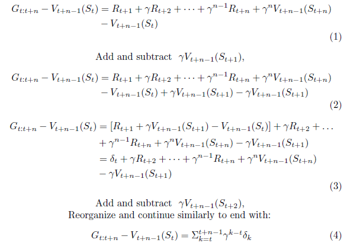
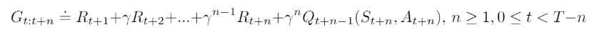
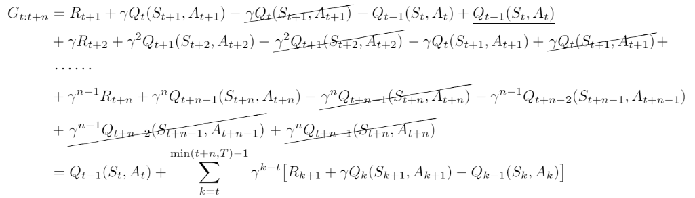

<b>Exercise 7.1: </b> In Chapter 6 we noted that the Monte Carlo error can be written as the sum of TD errors (6.6) if the value estimates don't change from step to step. Show that the n-step error used in (7.2) can also be written as a sum TD errors (again if the value estimates don't change) generalizing the earlier result.

<b>Solution:</b> 

<b>Exercise 7.3: </b> Why do you think a larger random walk task (19 states instead of 5) was used in the examples of this chapter? Would a smaller walk have shifted the advantage to a different value of n? How about the change in left-side outcome from 0 to -1 made in the larger walk? Do you think that made any difference in the best value of n?

<b>Solution:</b> Larger random walk task was used to test out performance for different values of n - both small and large. The use of smaller task doesn't allow us to test out for larger values of n as it would mostly always turn out to be MC and not TD. A smaller walk would definitely have changed the performance outcomes. Changing the value of a reward from 0 to -1 wouldn't affect the best value of n in my opinion, it would however change the state values.

<b>Exercise 7.4</b> Prove that the n-step return of Sarsa (7.4) can be written exactly in terms of a novel TD error.

<b>Solution:</b> 

<b>Exercise 7.6</b> Prove that the control variate in the above equations does not change the expected value of the return.

<b>Solution:</b> 

